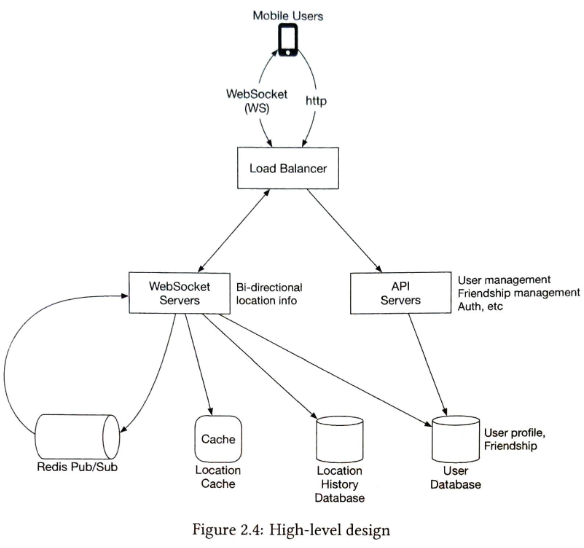

# 1.문제 이해 및 설계 범위 확정

1. 지리적 범위
   - 5마일 (설정 가능)
2. 거리 계산 방법 설정
   - 직선 거리
3. 서비스 처리 규모
   - 10억명 가정, 1억명 기능 활용
4. 데이터 보관
   - 이동 이력 저장
5. 활성 상태
   - 10분 이상 비활성 상태라면 사라지도록
6. 정보 보호
   - GDPR등의 데이터보호법 고려X
     <br>

### 기능 요구사항

1. 위치 표시

- 주변 친구 목록 제공
- 각 친구까지의 거리 표시
- 정보 갱신 시간 표시
- 주기적 데이터 갱신

### 비기능 요구사항

1. 성능

- 실시간 위치 반영 (낮은 지연)

2. 가용성

- 높은 안정성 제공
- 일부 데이터 유실 허용

3. 일관성

- `결과적` 일관성 허용
- 몇 초 간의 데이터 불일치 허용

#### 가용성의 데이터와 일관성의 데이터?

`가용성의 데이터`
실시간 위치 데이터 전송 과정에서 일부 위치 업데이트가 유실되는 것
예: 친구가 30초마다 위치를 보내는데 네트워크 등의 문제로 그 중 몇 개의 위치 신호가 누락되어도 허용

`일관성의 데이터`
복제된 데이터베이스 서버들 간의 위치 정보 동기화
예: A서버에는 친구의 최신 위치가 반영되었는데, B서버에는 아직 이전 위치가 남아있는 상황 허용

즉, 가용성은 "원본 데이터의 유실"을, 일관성은 "서버간 데이터 동기화 지연"을 의미합니다.

### 개략적 규모 추정

- 1억 DAU
- 동시 접속자 = 1천만
- 사용자는 30초마다 자기 위치를 시스템에 전송
- 위치 정보 갱신 QPS = 천만 / 30 = 334,000
  <br>

# 2.개략적 설계안 제시 및 동의 구하기

p2p방식은 실용적이지 않음

#### 왜 p2p 방식은 실용적이지 않는가?

P2P: 모든 친구와 직접 연결해서 위치를 주고받아야 함
중앙화: 서버가 위치 수집과 필터링을 대신 처리해줌

철수가 해야 하는 일:

1. 400명 친구 각각과 P2P 연결 수립
2. 30초마다 400명에게 자신의 위치 전송
3. 30초마다 400명으로부터 위치 수신
4. 받은 400개 위치를 5마일 반경으로 필터링

즉, 모든 친구에게 요청을 날릴 때마다, 모든 데이터를 요청해서 받아야하지만, 서버를 중간에 두어 이미 DB에 있는 데이터를 재사용하는 식으로 사용할 수 있습니다.

#### 백엔드의 역할

- 모든 `활성` 상태 사용자의 `위치 변화 내역` 수신
- 사용자 위치 변경 내역을 `수신`할 때마다 해당 사용자의 모든 활성 상태 친구를 찾아서 그 친구들의 단말로 변경내역 전달
- 특정 임계치보다 먼 경우에는 변경 내역 전송 x

`초당 위치정보 갱신 x 친구 수 x 친구 10%`가 활성화 상태라고 가정
초당 334,000 x 400 x 10% = 1400만

## 1. 설계안



#### Load Balancer

- API 서버와 양방향 stateful 웹 소켓 서버를 앞단에 배치하고, 트래픽을 고르게 분산하기 위해 서버에 배분하는 역할

#### Restful API Server

- 사용자 인증 및 인가
- 친구 관계 관리

#### WebSocket Server

- 친구 위치 정보를 거의 실시간에 가깝게 처리하는 Stateful 클러스터

어떻게 실시간에 통신을 처리할 수 있을까?
-> 이벤트 루프 방식 사용

```
이벤트 루프 {
    while(true) {
        // epoll_wait()를 호출하면 cpu를 사용하지 않음.
        1. epoll_wait()로 이벤트 발생 감지
        2. 발생한 이벤트 목록 받기
        3. 각 이벤트 타입 확인
           - 새로운 연결 -> 소켓 생성, epoll 등록
           - 데이터 수신 -> 메시지 처리
           - 연결 종료 -> 정리 작업
        4. 다시 1번으로
    }
}
```

#### Redis Cache

- 활성 상태 사용자의 최근 위치 정보 캐싱
- id : {위도, 경도, 시각}

#### User DB

- 사용자 데이터 및 친구 정보 저장

#### Location DB

- 위치 변동 이력을 보관
- user_id/latitude/longitude/timestamp

#### Redis Pub/Sub

- 초경량 메시지 버스
- 만약 웹소켓 서버가 스케일아웃된다면, 사용자 정보에 대한 웹소켓 서버간 일관성 문제가 발생하여 Pub/Sub를 사용합니다.

##### Message Queue vs Pub/Sub (Pattern)

실시간 위치는 신선도가 중요하고 유실되도 다음 업데이트로 대체되므로, 메시지큐의 안정성(순서보장/실패시 재처리)이 오버헤드가 됨
Pub/Sub는 - 재전송이나 순서 보장 없음

#### 주기적 위치 갱신

`<위치 변경 시나리오>`

1. 위치 변경 이력 DB에 저장
2. 캐시에 새 위치 정보 저장(거리 계산 용)
3. pub/sub 서버에 새 위치를 발행함.
4. 모든 구독자(온라인 상태 친구들) 에게 broadcast
5. 메시지를 받은 웹소켓 서버가 사용자간 거리를 새로 계산

51p의 그림 2.8을 보면 각 사용자마다 pub/sub을 만든 것을 볼 수 있습니다.
저는 이 그림을 보며 이게 최선일까?
이렇게 두면 모든 사용자에 대해 전용 채널을 만들어야하는 것 아닌가?라는 생각을 하게 되었습니다.
만약 100만명이라면 100만개의 pub/sub을 만들어야하는데, 메모리 부담이 되지 않을까 생각이 듭니다.
위처럼 분리해두면, 친구가 결국 구독자가 되니까 친구에 대한 별도 필터링이 필요 없기야 하겠지만 이게 최선일까라는 생각이 들었습니다.

#### 위치 정보 저장하지 않는 이유

- 주변 친구 기능은 사용자의 `현재` 위치만을 이용합니다.
  -> 이전의 위치가 필요 없기에, durability 보장이 필요 없어 캐시로도 충분합니다.
