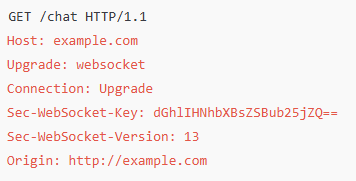
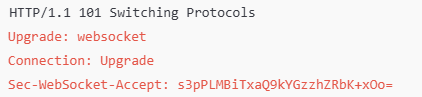

## 웹소켓통신

WebSockets provides a Full duplex communication channel over a single TCP connection.
It provides a persistent connection between a client and a server that both parties can use to start sending data at any time.

요청-응답 모델을  따르는 HTTP와 달리 웹소켓은 양방향 통신을 가능하게 하여 클라이언트와 서버 모두가 비동기적으로 메세지를 주고 받을 수 있음.

### 웹소켓 핸드쉐이크 프로세스

1. HTTP업그레이드 요청 : 클라이언트는 서버에 HTTP 업그레이드 요청을 보내 핸드쉐이크를 시작하여 웹소켓 프로토콜로 전환하려 함.

2. 업그레이드 요청을 받으면 서버는 HTTP 101 상태코드로 응답하여 웹소켓 프로토콜에 대한 업그레이드 성공을 전달.

3. 헤더 및 키 생성 : 핸드쉐이크동안 클라이언트와 서버는 모두 웹소켓 연결을 설정하는데 필요한 정보가 포함된 헤더를 교환한다. 클라이언트는 임의의 키를 생성하고, 이 키는 미리 정의된 웹소켓 GUID와 결합한 다음 base64로 인코딩된다.

4. 검증 및 수락 : 서버는 수신된 키를 검증하고, 클라이언트 키와 GUID를 연결하여 응답키를 구성한 다음, 이를 base64인코딩한다. 서버가 클라이언트의 요청을 수락하면 응답 헤더에 응답 키를 포함.

5. 연결 설정 : 클라이언트가 서버의 응답을 받으면 응답 키를 검증하여 올바른 서버와 연결이 설정되었는지 확인. 검증이 성공하면 웹소켓 연결이 열려 양방향 통신이 가능해짐.

## aws 로드밸런서에 대해서

AWS ALB는 Websocket을 지원.
HTTP연결 업그레이드를 사용하여 기존 HTTP/1.1 연결을 웹소켓 연결로 업그레이드 할 수 있음.
업그레이드하면 요청에 사용되는 TCP연결이 로드밸런서를 통해 클라이언트와 대상간의 지속적인 웹소켓 연결이 된다. 

주의할점은 aws idle_timeout.timeout_seconds이 60초이다.(조절가능)

서비스에 따라 다르겠지만 라우팅 알고리즘으로 Sticky Sessions을 사용하는 것이 적합할 수 있음.

stateful 하게 사용하고있으면 스티키세션을 사용하는게 좋고, stateless하게 사용하고 있으면 라운드로빈으로도 충분.

### 잡담

단일 서버에서 처리 가능한 웹소켓 연결 수에 영향을 미치는 요인들
1. 서버 하드웨어

   * CPU : 웹소켓 연결은 가벼운 편이지만, 각 연결마다 I/O처리를 위해 CPU자원을 사용.
   * 메모리 : 각 웹소켓 연결은 연결상태를 유지하기 위해 약간의 메모리를 사용
   * 네트워크 대역폭 : 웹소켓 데이터 전송

2. 운영체제 설정
   
   * 파일 디스크립터 limit : 각 웹소켓 연결은 파일 디스크립터를 사용하며 대부분의 유닉스 기산 시스템에서는 기본적으로 1024개의 파일 디스크립터 제한이 있음. unlimit 명령어로 늘릴 수 있음

3. TCP/IP 설정 : 운영체제는 동시에 열 수 있는 TCP 연결 수를 제한하고 있음.아래와 같은 설정을 통해 한도 설정 가능
   >sysctl -w net.core.somaxconn=4096 
   sysctl -w net.ipv4.tcp_max_syn_backlog=4096 
   sysctl -w net.ipv4.ip_local_port_range="1024 65535"

테스트한 블로그 글 : https://josephmate.github.io/2022-04-14-max-connections/

요약하면 아래와 같음
>Phoenix Framework achieved 2,000,000 connections 
WhatsApp achieved 2,000,000 connections 
Theoretical limit is ~1 quadrillion (1,000,000,000,000,000) 
You will run out of source ports (only 216) 
You can fix this by add loopback client IP addresses 
You will run out of file descriptors 
You can fix this by overriding the file descriptor limits of your OS 
Java will also limit the file descriptors 
You can override this by adding the -XX:MaxFDLimit JVM argument 
Practical limit on my 16GB Mac is 80,000 
Practical limit on my 8GB Linux is 840,000 
