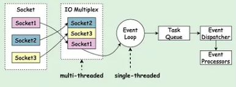
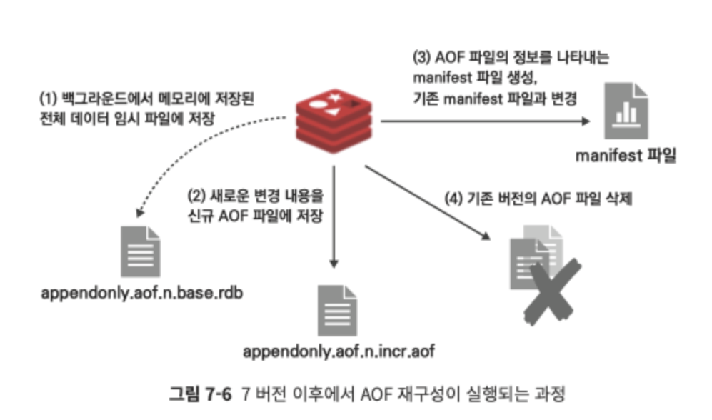
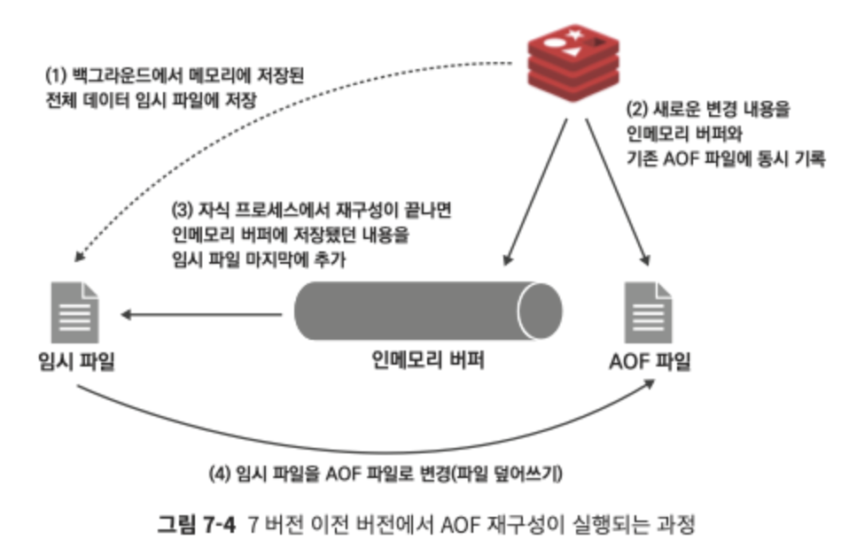
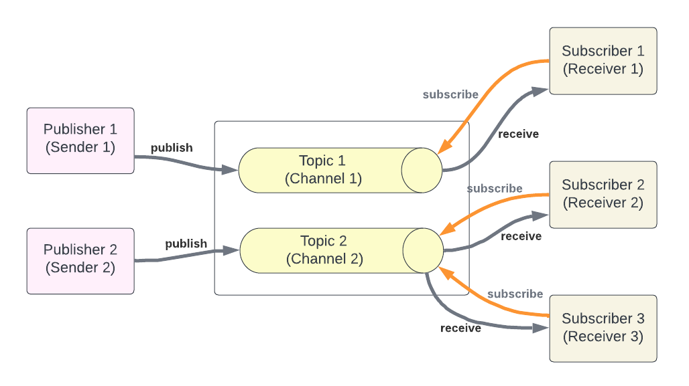

## Redis

Redis(Remote Dictionary Server)는 고성능의 인메모리 데이터 구조 스토어로, 주로 캐시, 세션 관리, 메시지 큐와 같은 용도로 활용. 데이터는 메모리에 저장되기 때문에 매우 빠른 읽기 및 쓰기 성능을 제공하며, 필요에 따라 데이터를 디스크에 저장하여 영속성을 보장할 수도 있음.

캐시, 세션관리, 실시간 분석, 실시간성 데이터, 큐 시스템 등 다양하게 활용 가능

### 싱글스레드 모델

* 레디스는 단일 스테드 모델이며 I/O멀티플렉싱 활용, 즉 여러 클라이언트의 요청을 비동기적으로 처리. 이때 epoll, select, kqueue와 같은 시스템 호출을 통해 여러 네트워크 연결을 동시에 관리
  - 장점 : 락을 사용할 필요가 없어 경합을 피할 수 있으며 컨텍스트 스위칭 오버헤드가 없음
  - 단점 : CPU집약적인 작업에서는 단일 스레드 사용으로인해 성능제한이 있을 수 있음.

* I/O에서는 멀티스레드를 사용하고 명령 처리에는 싱글 스레드 사용
 
출처 : https://dip-mazumder.medium.com/unlocking-redis-speed-how-i-o-multiplexing-and-in-memory-storage-make-redis-a-powerhouse-224f62750a1e

### 데이터 구조와 내부 메모리 관리

* redis는 다양한 데이터 타입을 지원
  - Strings : 일반적인 문자열을 저장, 최대 512MB까지 저장가능
  - List : 연결 리스트 형태로, 순서를 유지하는 값들의 집합
  - Sets : 중복을 허용하지 않는 집합
  - Sorted Sets(ZSets) : 각 요소가 점수(score)와 함께 저장되며, 점수에 따라 정렬
  - Hashs : 필드-값 으로 이루어진 맵구조
  - Streams : 시퀀스 데이터를 저장하는데 사용

* 레디스는 메모리 최적화를 위해 다양한 내부 자료 구조(SDS, Ziplist, intset 등)를 사용 
  ziplist 추가 상세 내용 : http://redisgate.kr/redis/configuration/internal_ziplist.php 참고
   
  sds(Simple Dynamic Strings) 추가 상세 내용 : http://redisgate.kr/redis/configuration/internal_string.php

### 영속성(persistence)

레디스는 기본적으로 인메모리에서 동작하지만 영속성을 보장하기 위해 두가지 디스크 저장방식을 제공

* RDS (redis database) : 특정 시점에 데이터의 스냅샷을 생성하여 디스크에 저장, 주로 주기적인 백업용도로 사용되며, dump.rdb 파일을 생성

* AOP (append-only file) : 모든 write 작업을 로그형태로 기록하여, 복구시 해당 로그를 순차적으로 재실행, appendonly.aof 파일에 저장되며, RDB방식보다 복구가 더 정확하지만, 상대적으로 느릴 수 있음 
7.0 이전까지는 하나의 파일을 사용했는데 이후에는 멀티파트 지원

출처 : https://devocean.sk.com/blog/techBoardDetail.do?ID=166166&boardType=techBlog

### 복제(replication)

* 레디스는 마스터-슬레이브 복제를 지원
  - 마스터 : write 작업을 처리, 데이터를 슬레이브 노드로 복제
  - 슬레이브 : read 전용, 마스터 장애시 대체 노드로 활용

* 복제는 비동기적으로 이루어지며, 설정은 replicaof 명령어로 구성

### 센티넬(sentinel)

* 고가용성을 위한 모니터링 및 장애조치 시스템
* 마스터 노드를 지속적으로 모니터링하고, 장애가 발생할 경우 자동으로 슬레이브 노드를 마스터로 승격
* 여러 센티넬 프로세스가 상호감시하며 다수결 원칙에 따라 장애조치(fail over) 결정

### 레디스 클러스터

* 레디스 클러스터는 데이텨 샤딩을 통해 수평 스케일링 지원
* 데이터를  16384개 슬롯으로 분할하고, 각 슬롯을 여러 노드에 분산 저장
* 특정 키가 어느 슬롯에 속하는지를 기준으로 해당 슬롯을 관리하는 노드로 요청을 라우팅
*마스터-슬레이브 구조로 운영, failover 가능

## pub/sub

* kafka의 경우 Topic에 pub되는 메세지들을 저장하지만, redis의 경우 pub되는 메세지를 저장하지 않기때문데 sub이 없으면 메세지는 사라짐.

* 간략하게 보면 클라이언트가 채널에 메세지를 pub하면 해당 채널을 sub하고 있는 클라이언트들이 즉시 메세지를 받을 수 있음.

  
출처 : https://oliveyoung.tech/blog/2023-08-07/async-process-of-coupon-issuance-using-redis/
