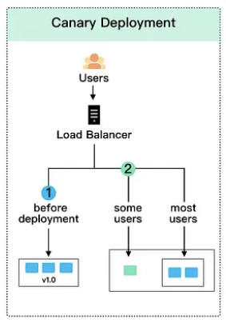

# 1챕터 : 근접성 서비스    

<h3>문제 조건</h3>
<li>1. 사용자가 지정한 범위 안에 사업장만 대상 ( 밤위 안에 사업장이 없어도 자동으로 범위 넓히지 않음 )</li>
<li>2. 최대 반경 20km</li>
<li>3. 검색 반경 사용자 설정 가능 (범위 사전 지정형)</li>
<li>4. 사업자가 사업장 등록, 삭제 등이 가능하며 다음날까지 시스템 반영</li>
<li>5. 사용자가 이동해도 실시간으로 반영은 필요 없음</li>
 
 

< QPS(queries per second) >

초당 쿼리 속도, 서버가 초당 처리할 수 있는 쿼리 수를 의미하며 특정 쿼리 서버가 지정된 시간 내에 처리하는 트래픽의 양

< TPS(transaction per second) >

초당 트랜잭션 수, 일반적으로 소프트웨어 테슽 결과를 측정하는 단위, 트랜잭션은 클라이언트가 서버에 요청을 보내고 서버가 응답하는 프로세스를 말함
클라이언트는 요청을 보낼 때 타이밍을 시작하고 서버의 응답을 받으면 종료되어 사용된 시간과 완료된 트랜잭션 수를 계산

  
<h3>내 생각 정리</h3>

문제조건 1번처럼 사용자가 지정한 범위 안에 사업장만 대상이 아니라 손가락으로 스크롤인아웃을 할 수 있었다면?  
  -> 스크롤인아웃을 할때 실시간으로 보여주기에는 시스템 부하가 너무 클 것으로 예상 
  -> 스크롤을 멈췄을때 검색하도록 진행  

문제조건 4처럼 다음날에 반영되어도 되는 배치성작업이기에 문제의 난이도가 조금 내려갔음. 
만약 1시간이였다면...정보를 저장하고 어떻게 업데이트할지 더 고민이 필요하며 지금과 같은 시스템이여도 상관은 없지만 배치가 1시간마다 돌게되어
장애발생확률이 높아짐. 하루씩 한다면 사용자가 제일 적을것으로 예상되는 새벽에 모든 작업을 진행.

개략적 설계(p7)을 보면 상단 로드밸런서가 LBS와 사업장 서비스 앞단에 있음. 
LBS는 상대적으로 사업장서비스보다 많은 호출이 예상되기 때문에 로드밸런서 2개를 사용하는 것도 좋아보임. 
기능상 사업장서비스는 일반적인 클라이언트가 아니기에 백오피스 시스템으로 볼 수 있음. 그래서 용도에 맞게 진입로를 분리해주는게 
트래픽 분리도 되며 LBS의 높은 사용자 사용률로 장애가 나더라도 백오피스와 같은 서비스에 영향이 안가도록 할 수 있음. 
LBS의 경우 트래픽이 상당할것 같은데 AWS ALB같은 경우도 MAX tps가 있어서 (정확하지는 않지만 몇년전 기억으로는 초당 1만...) 스케일업&아웃이 필요할수도.

데이터베이스는 어떤 것으로 사용하는 것이 좋을까 고민이 필요 
LBS시스템의 경우 트래픽이 높아 수평적 규모 확장이 쉽다고 되어 있는데, DB도 같이 스케일인아웃에 용이한 DB가 되어야 트래픽 병목이 생기지 않음. 
또는 책과 같이 DB앞단에서 레디스와 같은 캐시를 사용하는 것도 좋은 방법. 
또한 사업장서비스의 경우 write가 많은데, 글로벌 서비스로 가서 트래픽이 많아진다면 멀티마스터를 지원하는 DB가 좋을 것 같음. 
오라클만이 지원하던 기능인데 aws에서는 오로라가 2019년부터 지원하기 시작. 
오로라는 리전 내에서 최대 15개 복제본 지원. 
<https://aws.amazon.com/ko/about-aws/whats-new/2019/08/amazon-aurora-multimaster-now-generally-available/>

책에서 말하는 지오해시의 경우 격자로 분할한후 00,01,10,11 .... 0000,0001,0010,0011,0100,0101,0110 이런식으로 분할 후 결합하여 확장시켜나가는 방식이다. 
검색반경을 키울때 지오해시값의 마지막 비트를 삭제하여 새로운 지오해시값을 사용해 주변 사업장을 넓게 검색해나가는 문제해결방식이 굉장히 새로웠음.

트리를 사용하여 사업장을 저장하는 방식이 써 있는데, 트리의 특징처럼 갱신시 조금 복잡할 수 있지만 이보다 더 좋은 자료구조를 찾을수 있을까?하는 생각도 들었음.\

28페이지 상세 설계부분을 보면 데이터베이스이 확장에 대한 이야기가 나옴. 샤딩이야기가 나옴. 
샤딩이란 간략하게는 대규모 데이터베이스를 여러 머신에 저장하는 프로세스이다. 정확히 위에서 말한 오로라 복제와는 다른 개념. 
샤딩이 중요한 이유는 어플리케이션이 커질수록 사용자수가 늘어나고 저장되는 데이터양도 많이져서 쓰기 및 읽기 시간이 지속적으로 늘어날 수 밖에 없음 
이런 문제를 해결하기 위해 데이터를 더 작은 사이즈로 청킹하고 분리시켜 해결. 또한 장애시 전면장애로는 이어지지 않는 장점 ( but 요즘 그냥 전부 HA구성하기에 
일반적인 복제방식을 써도 전면 장애로는 거의 이어지지 않음) 
샤딩의 방식도 여러가지가 있지만 단점으로는 어떻게 적절히 분산을 시키는가 일것이다.
  

일반적인 서비스 어플리케이션 배포방식을 보면 아래와 같이 3가지로 나눌 수 있다. 
<li>롤링업데이트</li>
<li>블루그린</li>
<li>카나리</li>

 
<https://2cloud.io/blog/kubernetes-deployment-strategies>

롤링업데이트는 말 그래도 정해진 비율만큼 서비스를 배포해나가는 방식이다.  
쿠버네티스 환경에서 pod는 기본적으로 롤링업데이트인데, 배포중 장애시 다시 원복을 해야하는데 롤링업데이트중에는 롤백이 안되는 치명적인 단점이 있다. 
서비스영향도에 고객에게 크지 않은 서비스정도는 좋지 않을까 생각이 든다.

블루그린은 흔하게 사용한다. 새롭게 배포될 서비스를 배포한 후 정상이라고 판단이 되면 트래픽을 전환시키는 방식이다. 
제일 모니터링하기도 쉽고 QA프로세스등 여러 검증단계를 추가하기도 좋다. 하지만 단시간동안이라도 인프라 비용이 2배가 되는 단점이 있음 

카나리는 롤링업데이트와 블루그린 사이정도라고 생각할 수 있다. 하지만 사용하는 곳은 많이 보지 못했다. 
첫번째로 모니터링이 굉장히 어려워지고, 두번째로 배포도 어려워지고, 세번째로는 istio같은 사이드카기반 트래픽제어 솔루션을 넣으면 카나리 구축이 쉬워지지만 
istio 솔루션 운영도 난이도가 있어 장애포인트가 될 수 있음.

<h2>결론 : 35페이지에 나와있는 아키텍쳐 그림에서 로드밸런서만 분리하면 더 좋은 구조가 아닐까 싶다.</h2>