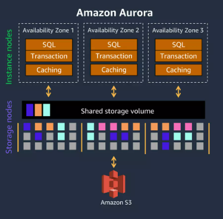
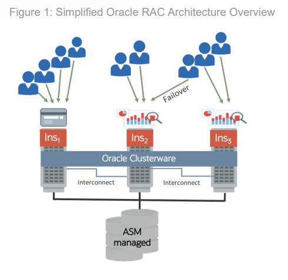

<h3>오로라</h3>

- 공유형 스토리지 이용
- 즉, 노드간 데이터 싱크를 위해 로그전송같은 로직이 없음
- 멀티 write 노드 지원 x (즉 write노드는 1개)
- write가 가능한 노드가 한개만 지원이 되기에 오라클처럼 캐시퓨전같이 복잡한 기술은 필요없음.
- 오로라는 write로 데이터가 들어오면 병렬로 6개의 스토리지 노드로 전송하며 최소 4개의 복제본이 저장되어야 함.
- 이러한 스토리지 노드는 3개의 가용 영역에 분산

<h3>오라클</h3>

- 공유형 스토리지 이용
- 즉, 노드간 데이터 싱크를 위해 로그전송같은 로직이 없음
- 오라클은 모든 노드가 write, read가 가능
- RAC가 핵심기술이며, 캐시퓨전이라는 복잡한 매커니즘이 필요

(https://www.oracle.com/technetwork/database/options/clustering/overview/new-generation-oracle-rac-5975370.pdf)
- 메모리간 필요한 데이터 직접 전송( 고속 네트워크를 통해 )
- 캐시퓨전은 일관성을 유지하기 위해 락킹 프로토콜을 이용해서 동시성을 제어

# 샤딩과 레플리케이션

<h3>샤딩</h3>

- 샤딩은 데이터 자체를 분할하여 각 데이터가 여러 데이터베이스 노드에 저장되는 분산방식
- 특정 노드에 장애발생시 데이터유실 가능성 있음 
- 데이터유실 방지를 위해 샤드를 복제하기도 함
- 요즘은 서버의 성능들이 좋아 샤딩은 오버스펙일 수 있음(운영이 너무 힘듬)
- 샤딩보다는 파티션테이블 구성으로도 충분히 분산 효과를 낼 수 있음

<h3>레플리케이션</h3>

- 데이터베이스를 복사하여 여러 노드에 배치하는 방식
- 데이터 복제 개념도 있지만 워크로드 분산의 의미도 있음
- 요즘은 5000 tps도 감당이 충분하게 되기때문에 샤딩까지 가는 경우는 많이 보지못함.
