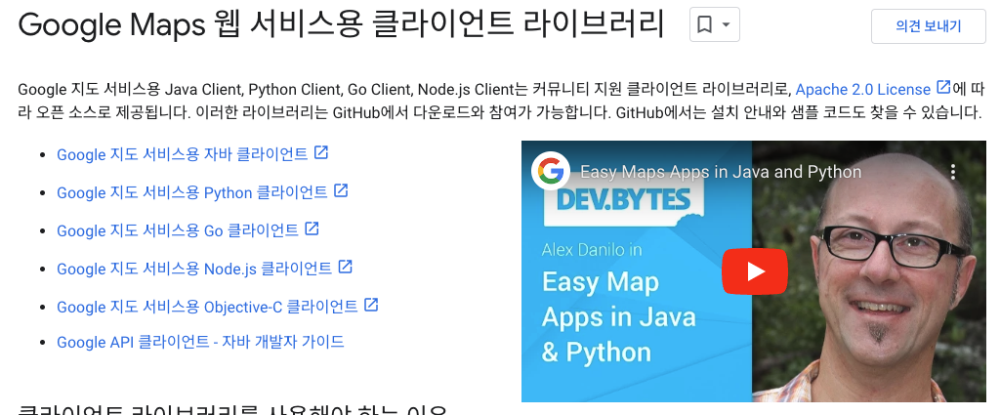

~~6p 까지 읽음

⛳️ 세줄 평!

1. 1장에서 소개하는 API 명세서와 읽기:쓰기 비율의 소개는 실망스러웠습니다.
2. 굳이 API 명세서를 소개해야 한다면 ***"일관성의 관점에서 하는 것은 어떤가?"*** 라는 가정을 해보았습니다.
3. 1장의 [7], [8] 레퍼런스 중에서 구글 API는 정확한 검색어, 부정확한 검색어, 위치기반 검색이라는 카테고리를 별도로 제공하는 것이 신기했습니다.

### 2.1. API 명세서에 대한 생각

도서에서 4~5p 동안 API 명세에 대한 설명을 했으나 실제로는 6p 에서 읽기:쓰기 비율에 대한 간단한 설명만 나왔습니다.

> 읽기 연산은 굉장히 자주 수행되는데, .... 한편 쓰기 연산 실행 빈도는 낮은데...

이 부분까지 읽고 아래와 같이 2가지 의문이 들었습니다.

1. 이 정도의 근거 - 결론을 내는데 API 명세서가 굳이 필요했는가?
2. 대규모 시스템 설계 과정에서 API 명세서를 굳이 소개해야 할 이유가 있는가?

그래서 굳이, "내가 API 명세서를 언급했다면, 이런 관점으로 소개했을 것이다"라고 생각하고 적어보았습니다.


책에서는 API 명세서의 설계 유무를 포인트로 잡았습니다만, <br>
저는 각 API 명세서 별 **일관성(Consistency)의 강도**가 중요하다 생각했습니다.

> CAP 정리의 핵심은 결국 "가용성과 일관성을 동시에 만족할 수 없다" 입니다.
> - 가용성* : 시스템을 사용할 수 있는 상태를 나타내는 지표 (확장성과 다름)
> - 일관성* : 쉽게 생각하면 데이터의 오차가 없는 정도를 나타내는 지표
> 
> 시스템이 항상 사용가능하게 처리하기 위해서 메세지(Kafka)를 사용하면 정보의 일관성이 꺠지게 됩니다. <br>
> 시스템의 일관성을 지키게 하기 위해서 작업의 원자성을 강하게 보장하면 시스템이 높은 부하에 취약해집니다.

즉, 도서에서 소개한 5가지 앤드포인트를 언급할 것이라면, <br>
서비스의 특징과 기능의 특성을 연결하여 **기능별 일관성의 강도를 제안** 하는 것이 맞다고 생각합니다.

| 기능              | 앤드포인트                   |
| ---------------- | ------------------------- |
| 전체 검색          | GET /v1/search/nearby     |
| 특정 사업장 조회     | GET /v1/business/:id      |
| 새로운 사업장 추가   | POST /v1/business         |
| 사업장 상세 정보 갱신 | PUT /v1/business/:id      |
| 특정 사업장 정보 삭제 | DELETE /v1/business/:id   |

예를 들어 내 주변의 쇼핑몰 & 식당을 추천하는 서비스를 설계한다고 생각해봅시다. <br>
이때 사장님은 최대한 많은 손님이 방문하기를 원하고 손님은 최대한 헛걸음을 안하고 싶어할 것입니다. <br>
따라서 사장님과 손님의 입장에서 원하는 일관성의 강도는 다를 수 있습니다.

| 기능              | 앤드포인트                   | 고객 입장                             | 사장 입장                             | 포인트 |
| ---------------- | ------------------------- | ----------------------------------- | ---------------------------------- | ---- |
| 전체 검색          | GET /v1/search/nearby     | 강한 일관성                            | 강한 일관성                           |      |
| 특정 사업장 조회     | GET /v1/business/:id      | 강한 일관성                            | 강한 일관성                           |      |
| 새로운 사업장 추가   | POST /v1/business         | 최종 일관성                             | 강한 일관성                          | 👀    |
| 사업장 상세 정보 갱신 | PUT /v1/business/:id      | 강한 일관성                            | 강한 일관성                           |      |
| 특정 사업장 정보 삭제 | DELETE /v1/business/:id   | 강한 일관성                            | 최종 일관성                           | 👀    |

이렇게 일관성의 강도가 충돌되는 경우 **둘 모두를 만족시킬 수는 없습니다.** <br>

따라서 플랫폼 서비스로서 더 중요한 대상인 고객의 입장에서 결론을 내리는 것이 옳다고 생각 합니다. <br> <br>

다만 대규모 트래픽을 상정한 설계라면 대부분 **최종 일관성**을 베이스로 설계를 진행하게 됩니다. <br>
이런 경우네는 특정 기능의 일관성 불일치를 해소할 수 있는 어시스트 전략이 필요해 보입니다.


<br>
<br>

---

<br>

### 2.1.1. API 레퍼런스에 대한 생각

도서에서는 실제 기업의 API 구현 사례를 2개 공유하고 있었습니다.

1. [Ref [7] 구글 장소 API](./2024_10_29_dil.md#ref-7-구글-장소-api)
2. [Ref [8] 옐프 사업장 API](./2024_10_29_dil.md#ref-8-옐프-사업장-api)

이를 확인했을때, 구글 API는 아래 3가지 경우에 맞춰 별도 API를 제공하는 점이 독특했습니다.

1. 장소 찾기 : 정확한 검색어 기반 검색
2. 주변 지역 탐색 : 위치 기반 검색
3. 텍스트 검색 : 부정확한 검색어에서도 대상 탐색

더 자세한 부분은 하단 글을 참고해주세요.

#### Ref [7] 구글 장소 API

개인적으로 구글의 API 문서의 가독성이 매우 나쁘다고 생각했다. - [Ref](https://developers.google.com/maps/documentation/places/web-service/search)

최소한의 경고문과 설명만 써놓고 바로 API 호출 방법을 쓰는 것이 좋을 것 같다는 생각을 했다.

```shell
curl -X GET ~/maps/api/place/findplacefromtext/output?parameters... 
```

| 기능         | 앤드포인트                                                 |
| ----------- | ------------------------------------------------------- |
| 장소 찾기     | ~/maps/api/place/findplacefromtext/output?parameters... |
| 주변 지역 검색 | ~/maps/api/place/nearbysearch/output?parameters...      |
| 텍스트 검색   | ~/maps/api/place/textsearch/output?parameters...         |

사실 이마저도 클라이언트/서버측 SDK를 제공하고 있기 때문에 큰 의미가 있나 싶다.

> 아... 그래서 API 명세서는 큰 애정을 기울이지 않은건가?



<br>
<br>

---

<br>

#### Ref [8] 옐프 사업장 API

옐프는 지역 비즈니스와 소비자를 연결하는 플랫폼 기업이다.


옐프의 API 명세서는 직관적으로 앤드포인트 파악이 가능했습니다. - [Ref](https://docs.developer.yelp.com/reference/v3_business_search)

```shell
GET https://api.yelp.com/v3/businesses/search
```
